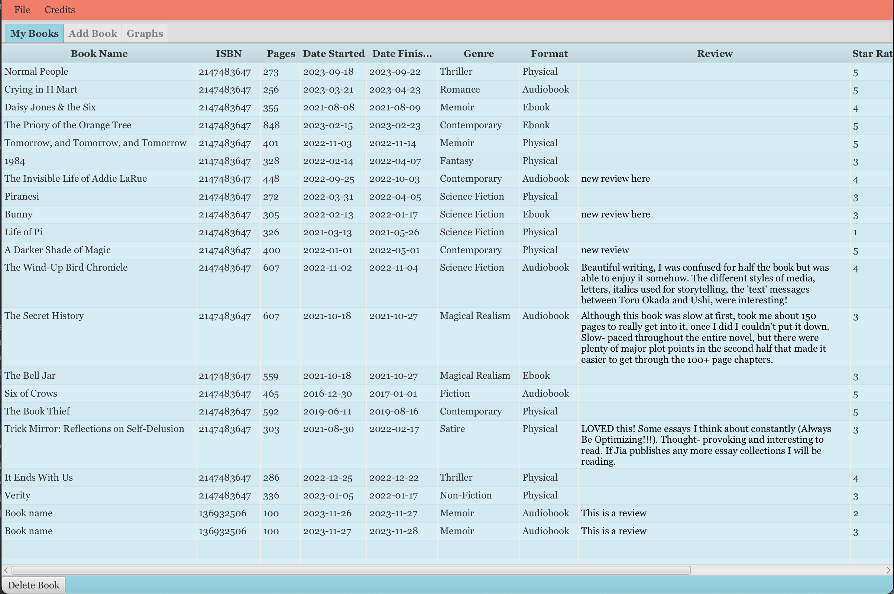
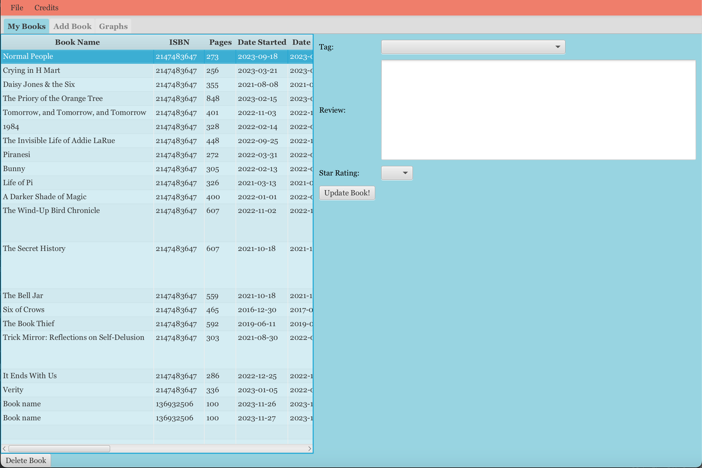
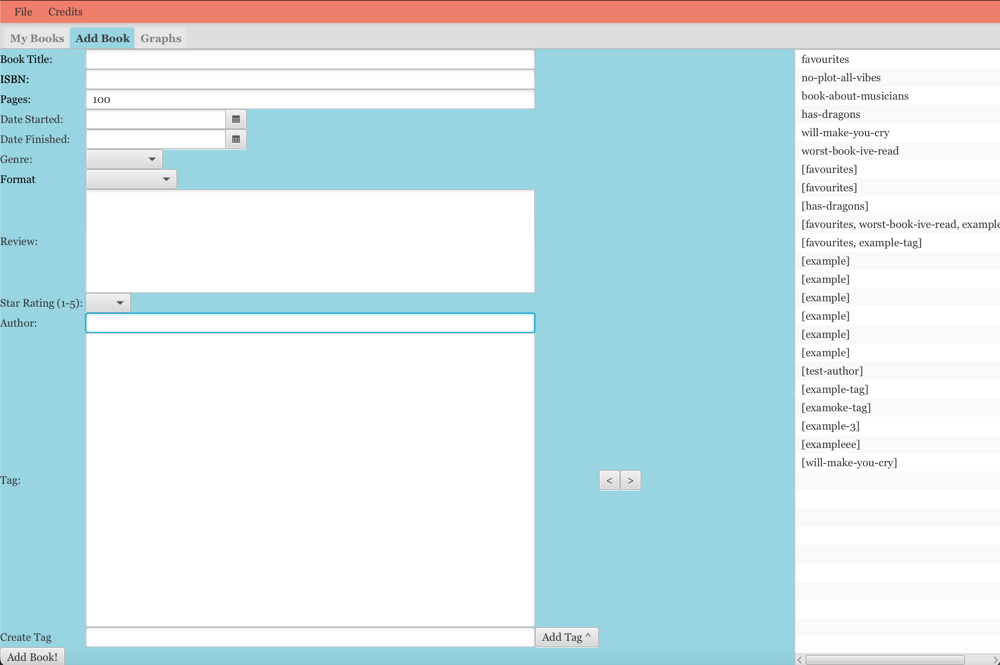
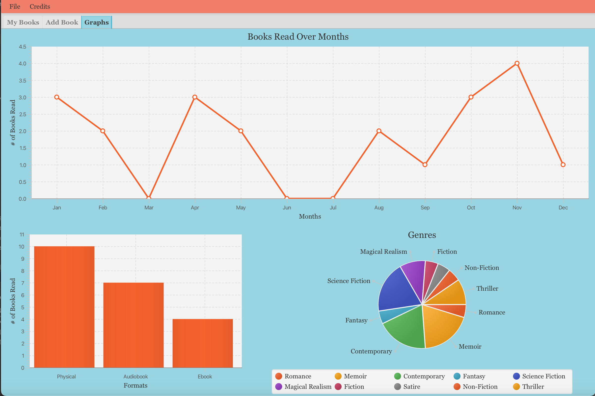
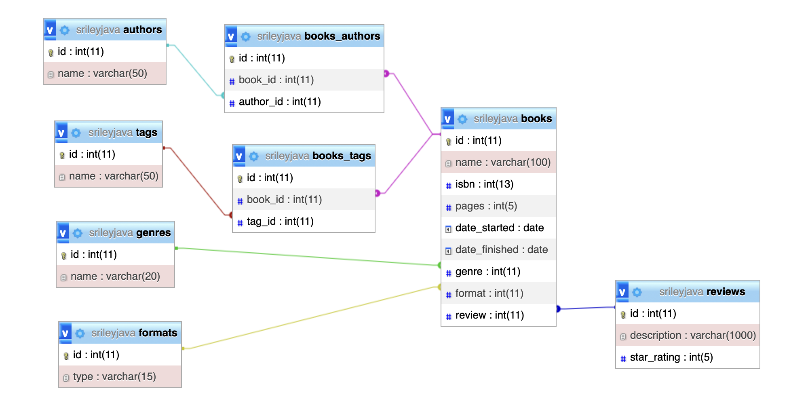

<h1 style="text-align:center">Welcome to BiblioNota</h1> 

## Description
Do you consider yourself a bookworm? Do you wish you could track all books you've read and write reviews for them? Well, BiblioNota is perfect for you!

BiblioNota is a piece of software designed to record information about a reader’s habits and display useful facts to the reader. Simply add in a book that has been read, or is even being read currently, and it will be recorded into the system.

## Installation
Download code from github repo: <a href="https://github.com/sierrariley/BiblioNota.git">click here</a>

## Getting Started Guide
- First login with your database credentials
- Tables will be created (check your PhpMyAdmin)
- You can now:
    - Add a book
    - Update a Book
    - Delete a Book
- Graphs will update as you add more books.
    - Number of books read
    - Genres of books read
    - The format of books read

## Screenshots
<table>
 <tr>
    <td>
      
    </td>
    <td>
      
    </td>
    </tr>
    <tr>
     <td>
      
    </td>
     <td>
      
    </td>
 </tr>
  <tr>
     <td>
      
    </td>
    </tr>
</table>

## Database Schema

## Credits
Assets created using <a href="https://www.canva.com/">Canva.com</a>

Background Image by <a href="https://www.freepik.com/free-vector/world-book-day-background_23761048.htm#query=library%20background&position=41&from_view=keyword&track=ais">Freepik</a>.

## License

&copy Copyright 2023 - All Rights Reserved

## Authors/Contact
Sage Lawrence: <a href="https://github.com/sagelawrence04">@sagelawrence04 </a>

Sierra Riley: <a href="https://github.com/sierrariley">@sierrariley</a>